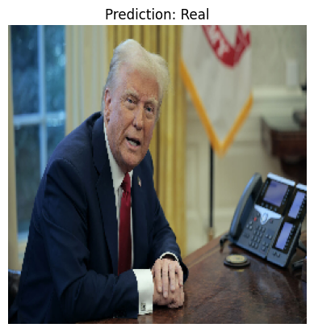
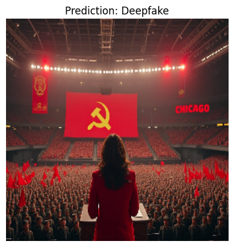

# The Inquisitor: Deepfake Image Classification Using MesoNet
### Developed by Devon, Will, Remy
This notebook implements a Convolutional Neural Network (CNN) based on the MesoNet architecture to classify images as real or deepfake. The workflow includes data loading, model definition, training, and prediction visualization. TensorFlow and Keras are used to build and train the model, while Matplotlib is used for result visualization.


```python
# Import packages
import numpy as np
import matplotlib.pyplot as plt
import os
from tensorflow.keras.models import Model
from tensorflow.keras.layers import Input, Conv2D, BatchNormalization, MaxPooling2D, Flatten, Dense, Dropout
from tensorflow.keras.optimizers import Adam
from tensorflow.keras.preprocessing.image import load_img, img_to_array

# Image dimensions
im_dim = {"height": 256, "width": 256, "channels": 3}

# Create a classifier class
class Classifier:
    def __init__(self):
        self.model = None

    def predict(self, x):
        return self.model.predict(x)

    def fit(self, x, y, epochs=10, batch_size=32):
        return self.model.fit(x, y, epochs=epochs, batch_size=batch_size)

    def get_accuracy(self, x, y):
        return self.model.evaluate(x, y)

    def load(self, path):
        self.model.load_weights(path)

# Create MesoNet class using Classifier
class Meso(Classifier):
    def __init__(self, learning_rate=0.001):
        super().__init__()
        self.model = self.init_model()
        optimizer = Adam(learning_rate=learning_rate)
        self.model.compile(optimizer=optimizer, loss="binary_crossentropy", metrics=['accuracy'])

    def init_model(self):
        x = Input(shape=(im_dim['height'], im_dim['width'], im_dim['channels']))

        x1 = Conv2D(8, (3, 3), padding='same', activation='relu')(x)
        x1 = BatchNormalization()(x1)
        x1 = MaxPooling2D(pool_size=(2, 2), padding='same')(x1)

        x2 = Conv2D(8, (5, 5), padding='same', activation='relu')(x1)
        x2 = BatchNormalization()(x2)
        x2 = MaxPooling2D(pool_size=(2, 2), padding='same')(x2)

        x3 = Conv2D(16, (5, 5), padding='same', activation='relu')(x2)
        x3 = BatchNormalization()(x3)
        x3 = MaxPooling2D(pool_size=(2, 2), padding='same')(x3)

        x4 = Conv2D(8, (3, 3), padding='same', activation='relu')(x3)
        x4 = BatchNormalization()(x4)
        x4 = MaxPooling2D(pool_size=(2, 2), padding='same')(x4)

        flat = Flatten()(x4)
        dense1 = Dense(16, activation='relu')(flat)
        drop = Dropout(0.5)(dense1)
        output = Dense(1, activation='sigmoid')(drop)

        return Model(inputs=x, outputs=output)

# Data Loading Function
def load_data(directory):
    images, labels = [], []
    for label, folder in enumerate(['real', 'fake']):
        folder_path = os.path.join(directory, folder)
        for filename in os.listdir(folder_path):
            img_path = os.path.join(folder_path, filename)
            img = load_img(img_path, target_size=(im_dim['height'], im_dim['width']))
            img_array = img_to_array(img) / 255.0
            images.append(img_array)
            labels.append(label)  # 0 for real, 1 for fake
    return np.array(images), np.array(labels)

# Prediction Function
def predict_image(model, image_path):
    img = load_img(image_path, target_size=(im_dim['height'], im_dim['width']))
    img_array = img_to_array(img) / 255.0
    img_array = np.expand_dims(img_array, axis=0)

    prediction = model.predict(img_array)[0][0]
    label = "Real" if prediction < 0.5 else "Deepfake"

    plt.imshow(img)
    plt.title(f'Prediction: {label}')
    plt.axis('off')
    plt.show()

# Training the Model
train_images, train_labels = load_data('train_data')
model = Meso()
print("Starting model training...")
model.fit(train_images, train_labels, epochs=10, batch_size=32)
print("Model training complete.")
```

    WARNING:tensorflow:From C:\Users\remys\anaconda3\envs\inquisitor\lib\site-packages\tensorflow\python\ops\init_ops.py:1251: calling VarianceScaling.__init__ (from tensorflow.python.ops.init_ops) with dtype is deprecated and will be removed in a future version.
    Instructions for updating:
    Call initializer instance with the dtype argument instead of passing it to the constructor
    WARNING:tensorflow:From C:\Users\remys\anaconda3\envs\inquisitor\lib\site-packages\tensorflow\python\ops\nn_impl.py:180: add_dispatch_support.<locals>.wrapper (from tensorflow.python.ops.array_ops) is deprecated and will be removed in a future version.
    Instructions for updating:
    Use tf.where in 2.0, which has the same broadcast rule as np.where
    Starting model training...
    Epoch 1/10
    626/626 [==============================] - 44s 70ms/sample - loss: 0.7518 - acc: 0.7093
    Epoch 2/10
    626/626 [==============================] - 51s 82ms/sample - loss: 0.4196 - acc: 0.8195
    Epoch 3/10
    626/626 [==============================] - 49s 78ms/sample - loss: 0.3201 - acc: 0.8674
    Epoch 4/10
    626/626 [==============================] - 44s 71ms/sample - loss: 0.2645 - acc: 0.8978
    Epoch 5/10
    626/626 [==============================] - 40s 65ms/sample - loss: 0.2038 - acc: 0.9105
    Epoch 6/10
    626/626 [==============================] - 43s 69ms/sample - loss: 0.1459 - acc: 0.9393
    Epoch 7/10
    626/626 [==============================] - 42s 67ms/sample - loss: 0.1154 - acc: 0.9601
    Epoch 8/10
    626/626 [==============================] - 38s 61ms/sample - loss: 0.1360 - acc: 0.9505
    Epoch 9/10
    626/626 [==============================] - 41s 66ms/sample - loss: 0.1142 - acc: 0.9537
    Epoch 10/10
    626/626 [==============================] - 44s 71ms/sample - loss: 0.0923 - acc: 0.9569
    Model training complete.
    

# Model Testing on Political Figures
In this section, we test the trained model using two sample images of political figures found online. One image is real, and the other is a deepfake. The model predicts the authenticity of each image, and the results are visualized with corresponding labels.


```python
# Testing the Model
print("\nTesting on Real Image:")
predict_image(model.model, 'test_data/real/sample.jpg')

print("Testing on Fake Image:")
predict_image(model.model, 'test_data/fake/sample.jpg')
```

    
    Testing on Real Image:
    


    

    


    Testing on Fake Image:
    


    

    

